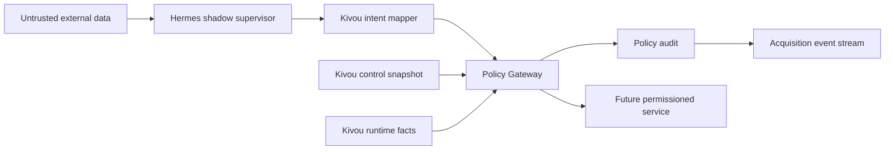

# SPEC-019 — Kivou Policy Gateway — Design

Date: 2026-08-20
Status: APPROVED — REQUIRED CORRECTIONS INCORPORATED
Branch: `feat/spec019-policy-gateway`
Base: `main` at `ea116a25d58bd5de9a80a607c22ad0c82bbd1b81`
Current Alembic head: `0007_acquisition_event_store`

## Objective

Build the deterministic Kivou-owned authorization boundary that every future Acquisition Engine command must cross:

```text
Hermes advisory intent
        ↓
Kivou intent mapper
        ↓
Policy Gateway
        ↓
durable structured decision
        ↓
future permissioned service — not implemented in SPEC-019
```

Hermes proposes. Kivou authorizes. A future permissioned service may execute only after a fresh gateway evaluation. SPEC-019 contains no executor, provider client, outbound integration, scheduler, customer mutation, or policy self-modification path.

## Current architecture and evidence anchors

SPEC-017 already provides immutable `SupervisorPlan` / `ProposedAction` contracts and a registry containing names only. `src/signals/supervisor/registry.py` exposes `ALLOWED_COMMANDS` as a `frozenset`; it contains no functions, clients, shell commands, or executors. `src/signals/supervisor/contracts.py` validates bounded advisory intents but treats their external content as data.

SPEC-018 provides a distinct durable Acquisition Opportunity, append-only `acquisition_event`, pure version-selected replay, scoped idempotency, and optimistic concurrency in `src/signals/acquisition/`. Procurement `opportunity_key` remains a different business identity.

No current customer route, ingestion job, alert job, billing flow, or Hermes adapter imports a Policy Gateway. SPEC-019 remains internal acquisition infrastructure.

## Approaches considered

### A. Pure evaluator + environment-only controls + opportunity events

This is the smallest code footprint and needs no migration. It is rejected because a process-local or ordinary environment default cannot prove that kill switch and READ ONLY survive restart, and `acquisition_event` cannot safely audit `reallocate_volume` or `generate_weekly_report` without attaching them to a fake opportunity.

### B. Pure evaluator + two narrow durable policy tables — recommended

Keep all policy logic pure and versioned, but persist Kivou-controlled policy snapshots and every evaluation in two dedicated, append-only tables. Opportunity-scoped decisions additionally append a state-neutral SPEC-018 event in the same transaction. This provides restart-safe hard controls and honest global audit without creating a generic Event Bus.

### C. Standalone policy service / generic event platform

This would introduce networking, service authentication, deployment, queues, and distributed consistency before any executor exists. It is rejected as speculative and contrary to the current SQLAlchemy Core/PostgreSQL architecture.

## Proposed package boundaries

After approval, the implementation should add one focused package:

```text
src/signals/policy/
  contracts.py     immutable requests, snapshots, decisions and typed failures
  registry.py      static command policy metadata; names only, no callables
  mapper.py        validated ProposedAction → canonical PolicyRequest
  evaluator.py     pure acquisition-policy-v1 gate evaluation
  gateway.py       current snapshot load, evaluation and required audit commit
  audit.py         universal audit + opportunity-event composition
  store.py         SQLAlchemy Core policy snapshot/audit persistence
  __init__.py      narrow public API
```

The pure evaluator imports neither Hermes nor persistence. The mapper may import SPEC-017 data contracts, never the Hermes adapter. The audit layer may import SPEC-018 contracts/store, never an executor.

## Official status contract

The exact status enum is:

```text
APPROVED
DENIED
APPROVAL_REQUIRED
BUDGET_EXCEEDED
COMPLIANCE_BLOCKED
INSUFFICIENT_EVIDENCE
RATE_LIMITED
```

No other production status is introduced. `allowed` is derived and true only when effective `status == APPROVED` and `executable == true`. In every other case both are false.

Malformed contracts raise a typed validation error before evaluation. A well-formed but unknown command or policy version produces a durable `DENIED` decision with a stable reason code so the attempted authorization remains auditable.

## Policy versioning

Initial behavior is selected by:

```text
policy_version = acquisition-policy-v1
```

This is separate from `state_machine_version`, `schema_version`, supervisor version, and skill version. A registry selects the evaluator by the snapshot’s persisted policy version. Unknown versions fail closed with `DENIED / unsupported_policy_version`; the gateway never substitutes its newest evaluator.

Future semantic changes add a policy version and preserve the v1 evaluator for historical interpretation and replay of audits.

## Strict PolicyRequest

`PolicyRequest` is frozen, rejects extra fields, and contains only bounded values:

```text
request_id
command
target_ref
acquisition_opportunity_id            nullable only for global commands
expected_opportunity_version           required for opportunity audit

actor_type
actor_ref

canonical_arguments                    bounded canonical JSON string
action_fingerprint                     SHA-256 computed by Kivou mapper
scope                                  typed country/language/wedge refs

proposed_cost                          Decimal >= 0
currency                               ISO-4217 uppercase code
proposed_volume                        integer >= 0

reason_codes                           bounded tuple
evidence_refs                          bounded tuple
evidence_readiness                     authoritative typed state
compliance_assessment                  authoritative typed state
operational_readiness                  authoritative typed state

supervisor_plan_id                     nullable
supervisor_action_index                nullable
supervisor_version                     nullable
skill_version                          nullable
expected_policy_version
approval_grants                        tuple[ApprovalGrant, ...], maximum 4
```

Hermes cannot supply `action_fingerprint`, compliance, evidence readiness, operational readiness, approval state, policy version, budget usage, read-only state, or kill switch state. `mapper.py` receives a validated `ProposedAction`, rejects recursive secret/hidden-reasoning keys and oversized/non-finite JSON, canonicalizes arguments, and computes the fingerprint. External text remains inert data.

`canonical_arguments` is limited to 16 KiB. The evaluator uses only separately typed policy-relevant fields; it never interprets the canonical JSON as instructions. The durable audit stores the fingerprint, not the raw arguments.

## Immutable PolicySnapshot

One evaluation uses one frozen `PolicySnapshot` composed from Kivou-authoritative sources. At evaluation time `T`, the policy store selects eligible rows with `effective_at <= T` and `(expires_at IS NULL OR expires_at > T)`, then chooses the unique maximum `control_revision`. A higher eligible revision supersedes all lower eligible revisions. Expired and future rows are ignored. If none is eligible, `PolicyControlUnavailable` is raised and no executable decision exists; no default or expired fallback is synthesized.

```text
policy_snapshot_id
control_revision
policy_version
captured_at
valid_until

autonomy_mode
shadow_target_mode                     ASSISTED/AUTONOMOUS_CAPPED/ADAPTIVE_SCALE in SHADOW; NULL otherwise
read_only
kill_switch

allowed_commands
allowed_countries
allowed_languages
allowed_wedges

budget_envelope
  period_start / period_end
  currency
  cost_cap / cost_used
  volume_cap / volume_used

runtime_revision
```

The durable policy-control snapshot supplies version, mode, hard flags, allowlists, scopes, and caps. Current spend/usage and provider/mailbox readiness are captured immediately before evaluation by Kivou services and attached as typed runtime state. Compliance, evidence, and approvals are target/action-specific trusted attachments, not Hermes fields.

Missing, expired, internally inconsistent, or unsupported critical state fails closed. There is no permissive default for a missing policy snapshot, kill switch, READ ONLY, currency, or runtime revision.

`control_revision` is unique, at least 1, and strictly greater than the current maximum when appended. All effective/expiry timestamps are timezone-aware and `expires_at`, when present, is strictly later than `effective_at`. The normal store exposes append and selection only—no update/delete API.

## Command policy metadata and risk classes

The existing command-name registry remains immutable and callable-free. A parallel Kivou-owned metadata map defines policy behavior. Metadata contains enums, booleans, and evidence/budget profiles only.

| Command | Risk class | Scope | Policy-relevant behavior |
|---|---|---|---|
| `discover_suppliers` | PREPARATORY | opportunity | external read/cost; signal and public evidence required |
| `find_decision_makers` | PREPARATORY | opportunity | external read/cost; supplier identity required |
| `enrich_company` | PREPARATORY | opportunity | external read/cost; supplier identity required |
| `evaluate_opportunity` | PREPARATORY | opportunity | local analysis intent; signal/public evidence required |
| `prepare_campaign` | COMMERCIAL_MUTATION | opportunity | customer/prospect campaign mutation; verified contact, fit and recency required |
| `schedule_campaign` | COMMERCIAL_MUTATION | opportunity | send scheduling; compliance, evidence, cost, volume, mailbox and window gates required |
| `pause_campaign` | RISK_REDUCTION | campaign/global | provider control mutation; exempt from positive-action budget/send-quota gates |
| `classify_response` | PREPARATORY | opportunity | classification only; any unsubscribe/campaign mutation requires a different future command |
| `reallocate_volume` | COMMERCIAL_MUTATION | global/wedge | adaptive volume mutation; explicit bounds and positive volume budget required |
| `request_human_review` | HUMAN_REVIEW | opportunity or global | safe escalation; no commercial mutation |
| `generate_weekly_report` | READ_ONLY | global | inspection/reporting only |

`classify_response` is preparatory because this command records classification intent only. It cannot unsubscribe, pause, send, or mutate a campaign. Those effects must cross the gateway as separate registered commands.

## Autonomy-mode matrix

An explicit command allowlist and scope are required in every mode. A mode can reduce permission; it cannot create absent permission.

| Risk class | SHADOW | ASSISTED | AUTONOMOUS_CAPPED | ADAPTIVE_SCALE |
|---|---|---|---|---|
| READ_ONLY | counterfactual only | may approve | may approve | may approve |
| PREPARATORY | counterfactual only | may approve inside all gates | only explicitly allowed scope/budget | only explicitly allowed scope/budget |
| COMMERCIAL_MUTATION | counterfactual only | `APPROVAL_REQUIRED`, then may approve a valid bound grant | may approve only pre-authorized command/scope/caps | may approve only pre-authorized command/scope/caps |
| RISK_REDUCTION | counterfactual only | may approve | may approve | may approve |
| HUMAN_REVIEW | counterfactual only | may approve | may approve | may approve |

`reallocate_volume` is auto-authorizable only in `ADAPTIVE_SCALE`, inside explicit wedge, daily volume, and cost limits. In ASSISTED it requires a bound approval. In AUTONOMOUS_CAPPED it is denied; this preserves a meaningful distinction between capped execution and adaptive allocation.

### SHADOW result

SHADOW never returns an executable authorization. Gates are evaluated under required `shadow_target_mode`—which must be exactly ASSISTED, AUTONOMOUS_CAPPED, or ADAPTIVE_SCALE—to produce an optional `counterfactual_status` from the same official enum. Recursive `SHADOW` targets are invalid. Outside SHADOW, `shadow_target_mode` must be null. Effective behavior is:

```text
counterfactual would be APPROVED
→ status = DENIED
→ reason = shadow_mode_execution_blocked
→ counterfactual_status = APPROVED
→ executable = false
→ allowed = false
```

If a stronger gate already fails, its official status remains primary and execution is still false. This avoids an `APPROVED` value that future code could accidentally execute.

## READ ONLY semantics

READ ONLY blocks commands capable of commercial or provider mutation:

```text
prepare_campaign
schedule_campaign
reallocate_volume
```

It may still authorize safe reads/analysis subject to their normal evidence, budget, and rate gates:

```text
discover_suppliers
find_decision_makers
enrich_company
evaluate_opportunity
classify_response
generate_weekly_report
request_human_review
```

`pause_campaign` is the explicit asymmetric exception: it may be approved because stopping risk is safer than preserving activity. It still needs a known campaign target, an available provider control plane, a valid policy snapshot, and durable audit.

## Kill-switch semantics

Kill switch dominates autonomy, budget headroom, confidence, prior approvals, and recommendations. It implies the READ ONLY restrictions above and blocks every positive commercial mutation. `schedule_campaign`, `prepare_campaign`, and all `reallocate_volume` directions are denied; volume reduction is not overloaded as risk reduction because `pause_campaign` is the explicit safe stop primitive.

The following remain eligible, never automatically executable in SHADOW, and still cross all relevant non-mutation gates:

```text
pause_campaign
request_human_review
generate_weekly_report
safe inspection / classification commands
```

Hermes receives no reference to the policy-control store and cannot clear the switch.

## Human approval binding

`ApprovalGrant` is a strict trusted Kivou contract, not a Hermes boolean:

```text
approval_id
purpose                                ACTION or COMPLIANCE_REVIEW
command
target_ref
acquisition_opportunity_id             nullable for global command
action_fingerprint
policy_version
policy_snapshot_id
control_revision
scope_fingerprint
issued_at
expires_at
one_shot = true
consumed_at                            must be absent at evaluation
approved_by_actor_ref
```

`PolicyRequest.approval_grants` is an immutable tuple bounded to four entries. The gateway rejects wrong purpose, command, target, opportunity, fingerprint, scope, policy, snapshot revision, expired, future-dated, or consumed grants. Purposes are independent: `COMPLIANCE_REVIEW` can satisfy only a `REVIEW_REQUIRED` compliance gate, while `ACTION` can satisfy only the later commercial-authorization gate. An ASSISTED commercial mutation under `REVIEW_REQUIRED` therefore needs two exact grants. `BLOCKED` and `UNKNOWN` compliance cannot be overridden by any grant.

SPEC-019 does not create an approval UI/workflow or consume a grant. Since evaluation is not execution, one-shot consumption must later be atomic in the permissioned executor/approval service. Until then the decision always says `requires_revalidation = true`.

## Deterministic gate precedence

Contract validation happens before policy evaluation. For a valid request, gates execute in this fixed order:

1. kill switch / READ ONLY hard safety, with explicit safe-action exceptions;
2. policy version, command allowlist, autonomy eligibility, target and scope permission;
3. generic compliance state, where only an exact `COMPLIANCE_REVIEW` grant may satisfy `REVIEW_REQUIRED`;
4. required evidence readiness;
5. cost and volume budgets;
6. operational quota, mailbox, control-plane, and send-window state;
7. separate exact `ACTION` approval where commercial authorization requires it;
8. SHADOW effective-execution block when every earlier gate would approve.

The first failing gate determines primary status. All secondary reason codes are accumulated in the same registry order and deterministically deduplicated; set/dict iteration never affects output.

This ordering ensures that approval never overrides safety, compliance, evidence, budget, or provider controls. It also avoids requesting human approval for an action already objectively blocked.

Example:

```text
kill switch active + evidence missing + budget exceeded
→ status DENIED
→ primary reason kill_switch_active
→ secondary reasons insufficient_evidence, daily_cost_cap_exceeded
→ executable false
```

## Budget model

V1 uses one Kivou-authoritative daily envelope rather than speculative provider/wedge/mailbox accounting tables:

```text
currency
period_start / period_end
cost_cap / cost_used
volume_cap / volume_used
```

Commands declare budget dimensions `NONE`, `COST`, `VOLUME`, or `COST_AND_VOLUME`. Exact boundary is allowed (`used + proposed == cap`). Exceeding either dimension returns `BUDGET_EXCEEDED`. Money uses finite `Decimal`; binary float, negative cost, NaN, infinity, expired periods, and currency mismatch are rejected/fail closed. Volume is a non-negative integer.

The gateway neither reserves nor spends. Hermes cannot add, remove, or reinterpret an envelope. Future execution must re-read current usage and re-evaluate, so concurrent evaluations cannot collectively turn stale headroom into permission.

## Evidence model

The evaluator consumes, never computes, `EvidenceReadiness`:

```text
claims: SIGNAL, PUBLIC_EVIDENCE, SUPPLIER, VERIFIED_CONTACT,
        FIT_DECISION, RECENT_SIGNAL, CAMPAIGN_METRICS, RESPONSE
evidence_refs
assessment_version
observed_at
freshness: CURRENT / STALE / UNKNOWN
```

Command metadata supplies the required claim set. Missing claims or stale/unknown freshness for a profile that requires freshness returns `INSUFFICIENT_EVIDENCE`. The gateway does not run the Signal Engine, Need Graph, Fit, recency, contact verification, or personalization logic and never promotes inference to fact.

## Generic compliance model

The only generic enum is:

```text
ALLOWED
BLOCKED
REVIEW_REQUIRED
UNKNOWN
```

Results are deterministic:

```text
ALLOWED          → continue
BLOCKED          → COMPLIANCE_BLOCKED
REVIEW_REQUIRED  → continue only with exact COMPLIANCE_REVIEW grant; otherwise APPROVAL_REQUIRED
UNKNOWN          → COMPLIANCE_BLOCKED / compliance_state_unknown
```

The request carries the assessment version, evidence/reference, and observed time. No Swiss, French, EU, channel, lawful-contact, unsubscribe, or country doctrine is encoded. SPEC-025 remains authoritative for those determinations.

## Rate-limit and send-window model

`OperationalReadiness` supplies bounded authoritative states:

```text
provider_quota: READY / EXHAUSTED / UNKNOWN
mailbox_quota: READY / EXHAUSTED / UNKNOWN
send_window: OPEN / CLOSED / UNKNOWN
provider_control_plane: AVAILABLE / UNAVAILABLE / UNKNOWN
retry_after: timezone-aware datetime nullable
runtime_revision
```

Each command metadata profile selects only relevant gates. Exhausted, closed, unavailable, or required-unknown state returns `RATE_LIMITED`. `retry_after` is copied only when authoritative; otherwise it remains absent with a stable reason code.

`pause_campaign` ignores send-volume and mailbox quotas but requires provider control-plane availability. A quota exhausted by sending therefore cannot keep an unsafe campaign active.

## PolicyDecision

The immutable result contains:

```text
evaluation_id
request_id
status
counterfactual_status                  SHADOW only
allowed                                derived
executable

command
target_ref
acquisition_opportunity_id
action_fingerprint

reason_codes
policy_version
policy_snapshot_id
control_revision
runtime_revision
evaluated_at
valid_until                            timezone-aware datetime or NULL
requires_revalidation = true

currency
estimated_cost
proposed_volume
cost_remaining
volume_remaining
retry_after
approval_ids                           bounded tuple of grants actually used
evidence_refs
```

It contains no chain of thought, free-form model reasoning, raw prompt, raw provider response, secret, or raw arguments. `evaluation_id` is generated by Kivou, never Hermes.

## Idempotency and TOCTOU model

A policy decision is an observation, not a reusable capability. The chosen model requires immediate re-evaluation by the future executor using current policy-control revision, usage, compliance, evidence, operational state, and kill switch.

`action_fingerprint` binds command, target, opportunity, canonical arguments, typed scope, proposed cost/currency, and volume. `PolicyDecision.valid_until` is informational: it is the earliest known authoritative boundary among snapshot expiry, used approval expiries, budget period end, evidence/runtime validity where supplied, or null when no future boundary exists. It is never an invented TTL and always satisfies `valid_until <= snapshot.expires_at` when the snapshot expires. `requires_revalidation` is always true; time before `valid_until` is never sufficient authorization. If action arguments change, the fingerprint changes and prior approval/decision no longer matches.

A new evaluation attempt creates a new `evaluation_id` before its audit transaction, re-reads all authoritative inputs, and produces a new audit. A retry of the same uncertain attempt reuses the same ID and immutable evaluation inputs. Same ID plus the same semantic fingerprint returns the durable row/event without another stream increment. Same ID plus different semantics raises `PolicyEvaluationIdempotencyConflict` with no mutation. An existing `APPROVED` decision is never read as authorization input to the evaluator.

## Hermes boundary

```text
validated ProposedAction
        ↓
Kivou mapper validates/guards/canonicalizes
        ↓
PolicyRequest
        +
independent Kivou PolicySnapshot/runtime facts
        ↓
PolicyGateway.evaluate_and_record()
```

The gateway depends on Kivou contracts, not Hermes SDK/runtime classes. Hermes unavailable leaves contracts, evaluation, hard controls, and audit functional. Hermes malformed output is rejected by SPEC-017 before mapping. Hermes has no interface for snapshot creation, kill switch, READ ONLY, caps, approvals, or compliance state.

## Durable audit design

Every valid evaluation is persisted before a decision is returned. Audit failure raises `PolicyAuditUnavailable`; callers receive no executable authorization.

### Opportunity-scoped decisions

The transaction inserts the universal `policy_evaluation` row and appends state-neutral `POLICY_EVALUATED` to the exact Acquisition Opportunity stream using idempotency key `policy_evaluation:<evaluation_id>`. The event carries only safe structured fields. It advances stream version/audit pointer but is state-, decision-, retry-, and reference-neutral under the existing `acquisition-state-v1` reducer.

The request supplies expected opportunity stream version. The row, event and projection audit pointer commit atomically. A concurrency conflict or either write failure rolls back both audit surfaces; the caller reloads and performs a new evaluation with a new ID/current state. Old SPEC-018 streams replay identically before and after support for this additive audit event.

### Global decisions

`reallocate_volume` and `generate_weekly_report` are written only to `policy_evaluation` with `acquisition_opportunity_id = NULL`. They are never attached to an unrelated opportunity. This table is a narrow policy-decision journal, not a generic Event Bus or business event platform.

## Persistence and proposed migration 0008

Migration `0008_policy_gateway` is recommended after supervisor approval. Existing `0007` cannot safely represent global policy evaluations or durable global hard-control configuration.

### Table: `acquisition_policy_snapshot`

Append-only Kivou configuration history:

```text
policy_snapshot_id          String(64) primary key
control_revision            Integer unique, >= 1
policy_version              String(64)
autonomy_mode               String(32)
shadow_target_mode          String(32) nullable
read_only                   Boolean
kill_switch                 Boolean
allowed_commands            JSON bounded validated names
allowed_countries           JSON bounded codes
allowed_languages           JSON bounded codes
allowed_wedges              JSON bounded refs
currency                    String(3)
daily_cost_cap              Numeric(18,6)
daily_volume_cap            Integer
effective_at                timezone-aware DateTime
expires_at                  timezone-aware DateTime nullable
snapshot_fingerprint        String(64) unique
created_at                  timezone-aware DateTime
created_by_actor_type       String(16)
created_by_actor_ref        String(256)
reason_codes                JSON bounded
```

No update/delete method is exposed. The effective snapshot is the highest eligible `control_revision`, not an assumption that periods never overlap. Appending requires a unique revision greater than the current maximum. Gateway evaluation raises `PolicyControlUnavailable` when no row is eligible. Hermes, an opportunity, provider response, or LLM cannot append controls.

The migration does not silently seed permissive configuration. Tests may insert fixtures; production configuration remains a separate explicitly authorized operational step.

### Table: `policy_evaluation`

Append-only universal policy audit:

```text
evaluation_id               String(64) primary key
request_id                  String(128)
acquisition_opportunity_id  String(64) nullable FK RESTRICT
command                     String(64)
target_ref                  String(256)
action_fingerprint          String(64)
status                      String(32)
counterfactual_status       String(32) nullable
executable                  Boolean
reason_codes                JSON bounded
policy_version              String(64)
policy_snapshot_id          String(64) FK RESTRICT
control_revision            Integer
runtime_revision            String(64)
evidence_refs               JSON bounded
currency                    String(3) nullable
estimated_cost              Numeric(18,6) nullable
proposed_volume             Integer nullable
cost_remaining              Numeric(18,6) nullable
volume_remaining            Integer nullable
approval_ids                JSON bounded
evaluated_at                timezone-aware DateTime
valid_until                 timezone-aware DateTime nullable
retry_after                 timezone-aware DateTime nullable
requires_revalidation       Boolean fixed true
semantic_fingerprint        String(64)
```

`evaluation_id` is created before transaction entry. `semantic_fingerprint` makes retry semantics explicit: equal ID/equal fingerprint returns the existing durable result; equal ID/different fingerprint conflicts. Only operational indexes are proposed: `(acquisition_opportunity_id, evaluated_at)`, `(command, evaluated_at)`, `status`, and `evaluated_at`. No raw policy request, arguments, provider content, transcript, or secret is stored.

### Why protected environment configuration alone is insufficient

A required environment variable can survive a process restart, but it does not provide an append-only revision history, atomic selection of one current control snapshot, immediate shared visibility across workers, or durable audit of global decisions. A mutable local file has the same limitations. The two-table design is the smallest current PostgreSQL/SQLite-compatible solution that satisfies restart and global-audit requirements.

## Kill switch and READ ONLY durability

The authoritative hard flags live in the append-only effective `acquisition_policy_snapshot`. Every evaluation loads the current effective revision; there is no process-local fallback. Restart therefore reloads the same flags. Multiple workers observe the same database state. Future executors must re-evaluate immediately, so a newly effective kill-switch snapshot dominates old approvals and decisions.

SPEC-019 does not implement an operator UI or let the gateway mutate this table. A later protected administrative boundary can append snapshots, but must not share interfaces with Hermes or command execution.

## Threat model and fail-closed behavior

### Scope and assumptions

- In scope: advisory-intent mapping, immutable policy inputs, pure evaluation, durable policy control/audit, and SPEC-018 audit composition.
- Current runtime has no executor and no customer-facing policy endpoint.
- Future workers/services are assumed to authenticate to Kivou and to re-evaluate immediately before execution; the gateway decision is not a bearer token.
- Public procurement/prospect content and Hermes output may be adversarial. Kivou control snapshots, runtime usage, approval grants, compliance and evidence readiness are privileged inputs.
- VPS, network deployment, operator authentication UI, country law, and provider integrations are out of scope.



The arrow to the future service is a contract boundary only; no executor exists in SPEC-019.

### Security assets

| Asset | Objective |
|---|---|
| Kill switch / READ ONLY / policy scopes | integrity and availability; prevent unauthorized outbound |
| Budget caps and usage | integrity; prevent uncontrolled provider or sending spend |
| Approval bindings | integrity and non-reuse across action/target/policy |
| Policy decisions and event audit | integrity, traceability, restart continuity |
| Evidence/compliance state | integrity and provenance; no inference promoted to fact |
| Customer/company reputation | prevent unauthorized or non-compliant contact |

### Attacker model

Realistic capabilities include malicious public text influencing Hermes, a compromised/malfunctioning supervisor proposing any known command, replaying stale approvals/evaluations, malformed runtime facts, and operator configuration mistakes. The attacker does not currently have a Policy Gateway HTTP endpoint, database credentials, shell, Hermes tools, or an executor through SPEC-019.

### Principal abuse paths

| ID | Abuse path | Priority | Design mitigation |
|---|---|---|---|
| TM-001 | Prompt-injected public text causes Hermes to propose scheduling/outbound | high | proposal remains data; registry, mapper guards, independent policy snapshot, SHADOW denial |
| TM-002 | Old APPROVED result is replayed after kill switch, budget, target, or arguments change | high | decision is not a capability; fingerprint + revision + expiry + mandatory immediate re-evaluation |
| TM-003 | Restart clears kill switch/READ ONLY | high | append-only DB snapshot; no process-local/default fallback; fail closed without effective row |
| TM-004 | Approval for campaign A is reused for B | high | command/target/opportunity/fingerprint/scope/policy/snapshot binding and expiry |
| TM-005 | Concurrent workers over-authorize the same remaining budget | high future impact | gateway does not reserve/spend; future executor must re-evaluate current usage and atomically reserve in its own SPEC |
| TM-006 | Global action is hidden in an unrelated opportunity stream | medium | universal global audit row; opportunity event only for exact scoped target |
| TM-007 | Secret or hidden reasoning enters policy/audit payload | medium | recursive normalized-key guards, canonical bounded request, safe-field audit only |
| TM-008 | Nondeterministic multiple failures yield different authorization | medium | fixed gate and reason ordering with table-driven tests |
| TM-009 | Policy audit write fails but caller executes anyway | high | no decision returned as executable until audit transaction commits; typed fail-closed error |

Highest residual risk is future TOCTOU/budget reservation at the executor boundary. SPEC-019 makes the safe contract explicit but cannot atomically spend provider budget because execution remains out of scope.

## Proposed deterministic TDD groups

Implementation must begin only after design approval, using RED → GREEN cycles.

### Contracts and registry

- exact official statuses and derived `allowed`;
- known/unknown commands and callable-free metadata;
- unknown policy/autonomy/status fail closed; syntactically valid unregistered commands receive durable `DENIED / unknown_command`, while malformed symbolic strings fail contract validation;
- naive/invalid dates, unsupported actors, malformed refs and extra fields rejected;
- negative, NaN, infinite cost and invalid currency rejected;
- oversized canonical arguments, secret keys, hidden-reasoning keys and shell-like symbolic command injection rejected;
- every existing SPEC-017 command has exactly one policy metadata profile.

### Autonomy and hard controls

- valid known command approved under a complete envelope;
- SHADOW effective status non-executable with a non-SHADOW target; recursive/misplaced targets are rejected;
- ASSISTED commercial mutation requires exact approval;
- AUTONOMOUS_CAPPED only inside command/scope/cost/volume caps;
- ADAPTIVE_SCALE reallocation only inside supplied wedge and caps, never widening them;
- READ ONLY blocks commercial/provider mutation and allows justified reads;
- kill switch dominates budget, confidence, autonomy and approval;
- `pause_campaign`, `request_human_review`, and reporting retain their exact safe exceptions;
- `pause_campaign` ignores send quota but fails if provider control plane is unavailable.

### Approval binding

- bounded multiple grants, distinct ACTION/COMPLIANCE_REVIEW purposes, both required when both gates apply;
- wrong target, opportunity, fingerprint, scope, policy, snapshot revision rejected;
- expired, future-dated, or consumed grant rejected;
- general action approval cannot override compliance review;
- repeated evaluation never treats a prior decision as approval.

### Budget, compliance, evidence and rate gates

- cost/volume below and exactly at cap approved;
- cost or volume above cap returns `BUDGET_EXCEEDED`;
- currency mismatch and invalid numbers fail closed;
- compliance BLOCKED and UNKNOWN return `COMPLIANCE_BLOCKED`;
- REVIEW_REQUIRED returns `APPROVAL_REQUIRED` without inventing law;
- missing/stale/unknown required evidence returns `INSUFFICIENT_EVIDENCE`;
- provider/mailbox quota and closed window return `RATE_LIMITED`;
- authoritative retry time copied; absent retry time never invented;
- deterministic multi-failure primary status and secondary reason order.

### Audit and persistence

- migration `0007 → 0008`, fresh DB → head, PostgreSQL offline DDL, SQLite compatibility, prior tables unchanged;
- no effective control snapshot fails closed; newest eligible revision wins while expired/future rows are ignored;
- kill switch/READ ONLY survive fresh repository/engine construction;
- policy snapshots are append-only and higher revision selection is deterministic;
- every valid evaluation writes one append-only `policy_evaluation` row with policy/snapshot versions;
- same evaluation retry is idempotent, semantic mismatch conflicts, and a fresh evaluation creates a new audit;
- opportunity evaluation atomically writes universal audit plus state-neutral `POLICY_EVALUATED` event;
- old acquisition streams replay unchanged; `POLICY_EVALUATED` changes only audit/version metadata;
- audit event replay preserves acquisition state and advances stream version;
- concurrent opportunity version conflict writes neither row;
- global evaluations have no opportunity event and remain durably queryable;
- audit rejects/seals raw arguments, prompts, transcripts, secrets, and hidden reasoning;
- audit failure produces no executable decision.

### Isolation and side effects

- Hermes unavailable does not affect evaluator or policy store;
- no import/call path to Apollo, Instantly, Stripe, SMTP, shell, customer API, or executor;
- no frontend/customer/ingestion/alert behavior changes;
- 1,000 deterministic pure evaluator invocations measured with `perf_counter`, correctness asserted and no invented SLA.

## Non-goals

SPEC-019 does not implement:

```text
action execution or authorization caching
provider budget reservation/spend
approval UI/workflow or one-shot consumption
country/channel legal rules (SPEC-025)
Supplier/Signal Fit or matching
personalization
Apollo / Instantly / SMTP / Stripe
Event Bus / DLQ / worker / scheduler
customer API or frontend
policy self-modification
VPS, ops, systemd, deployment
```

## Expected implementation files after approval

```text
src/signals/policy/__init__.py
src/signals/policy/contracts.py
src/signals/policy/registry.py
src/signals/policy/mapper.py
src/signals/policy/evaluator.py
src/signals/policy/gateway.py
src/signals/policy/audit.py
src/signals/policy/store.py

src/signals/acquisition/contracts.py             add POLICY_EVALUATED
src/signals/acquisition/state.py                 state-neutral reducer case
src/signals/acquisition/store.py                 connection-aware atomic audit append
src/signals/persistence/schema.py                two narrow tables
src/signals/persistence/migrations/versions/0008_policy_gateway_policy_gateway.py

tests/test_policy_contracts.py
tests/test_policy_registry.py
tests/test_policy_evaluator.py
tests/test_policy_mapper.py
tests/test_policy_approval.py
tests/test_policy_audit.py
tests/test_policy_persistence.py
tests/test_policy_migration.py
tests/test_policy_performance.py
```

No file above is created by this design pass.

## Baseline verification

The isolated branch starts from the exact authorized main tree. Before writing this document:

```text
HEAD / origin main: ea116a25d58bd5de9a80a607c22ad0c82bbd1b81
Alembic head:       0007_acquisition_event_store
backend:            2911 passed, 0 skipped
frontend:           84 passed
frontend build:     PASS
frontend typecheck: PASS
frontend lint:      PASS
```

No migration `0008`, policy package, test, executor, or deployment artifact exists on this branch.

## Design decision summary

Migration `0008_policy_gateway` is recommended: **YES**.

Reason: existing `acquisition_event` cannot truthfully store global decisions, while process-local/environment-only hard controls cannot provide revisioned, shared, restart-safe kill-switch and READ ONLY state; two narrow append-only tables solve exactly those gaps without becoming an Event Bus.

Blocking unresolved questions: none. The two-table migration and atomic dual-audit boundary are supervisor-approved.

POLICY GATEWAY DESIGN APPROVED
